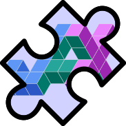

# Pallas Puzzles 2025

_This is a direct fork of the [Pallas Puzzles](https://github.com/rdyro/Pallas-Puzzles) on Github, itself a direct fork of [Triton Puzzles](https://github.com/srush/Triton-Puzzles), but adapted for the Pallas language for using a Triton-like kernel language (Pallas) in JAX._

_Pallas being an experimental feature in Jax, its API is susceptible of changing often. For that reason, the original Pallas Puzzles repository was not in sync with the latest Pallas APIs, nor the recommended way of handling memory. This fork is targetted at fixing those two points. I will take the liberty of changing the exercises to allow teaching the modern way of manipulating memory in Pallas._

Originally by Robert Dyro, Ed Schmerling; forked and updated by Pierre-Louis Nordmann.

## Introduction (from Pallas Puzzles)

Programming for accelerators such as GPUs is critical for modern AI systems.
This often means programming directly in proprietary low-level languages such as CUDA. [Pallas](https://jax.readthedocs.io/en/latest/pallas/index.html) is an alternative [Triton](https://github.com/triton-lang/triton)-like language that allows you to code at a higher-level and compile to accelerators like GPU and TPU for [JAX](https://jax.readthedocs.io/).

Coding for Pallas is very similar to Numpy and JAX in both syntax and semantics. However, as a lower-level language there are a lot of details that you need to keep track of. In particular, one area that learners have trouble with is memory loading and storage which is critical for speed on low-level devices.

This set is puzzles is meant to teach you how to use Pallas from first principles in an interactive fashion. You will start with trivial examples and build your way up to real algorithms like Flash Attention and Quantized neural networks. These puzzles **do not** need to run on GPU since Pallas has an interpreter, but be careful as the interpreter might produce somewhat different results to the GPU with masked loads and stores.

## Puzzles

You can find the puzzles in the notebook named [Pallas-Puzzles.ipynb](./notebooks/Pallas-Puzzles.ipynb). The puzzles with solutions are in the other notebook, [Pallas-Puzzles-Solutions.ipynb](./notebooks/Pallas-Puzzles-Solutions.ipynb). You can also directly open the puzzles notebook on Colab following [this link](https://colab.research.google.com/github/p-nordmann/pallas-puzzles-2025/blob/main/notebooks/Pallas-Puzzles.ipynb).

## Credits

If you like those puzzles, please have a look at the original [Pallas Puzzles](https://github.com/rdyro/Pallas-Puzzles) and [Triton Puzzles](https://github.com/srush/Triton-Puzzles), and if you feel like it, give them a star!
